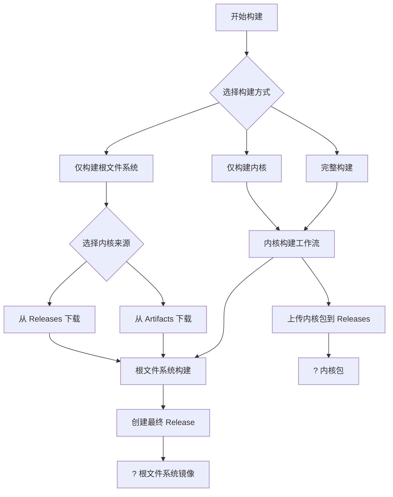

# ? Xiaomi K20 Pro (Raphael) 多发行版 Linux 系统

## ? 项目简介

这是一个专为小米 K20 Pro (代号: Raphael) 定制的多发行版 Linux 系统构建项目，支持 Ubuntu 和 Armbian 系统。通过自动化构建流程，为用户提供完整的 Linux 使用体验。

## ? 新的构建架构

本项目采用分离式构建架构，将内核构建和根文件系统构建分离，提供更灵活和高效的构建流程：

### ? 构建流程概览



### ? 工作流说明

#### 1. **独立内核构建** (`kernel-build.yml`)
- **触发方式**: 手动触发或通过版本管理器
- **输入参数**:
  - `kernel_version`: 内核版本 (如: 6.1.80)
  - `release_tag`: 发布标签 (如: v6.1.80)
  - `upload_to_release`: 是否上传到 Releases
- **输出**: 内核 DEB 包上传到 GitHub Releases

#### 2. **根文件系统构建** (`main.yml`)
- **触发方式**: 手动触发或通过版本管理器
- **输入参数**:
  - `kernel_version`: 使用内核版本
  - `distribution`: 发行版 (ubuntu/armbian)
  - `kernel_source`: 内核来源 (release/artifacts)
  - `release_tag`: 发布标签
  - `desktop_environment`: 桌面环境
- **输出**: 完整的根文件系统镜像

### ? 多发行版支持
- **Ubuntu**: 完整的桌面和服务器版本支持
- **Armbian**: 针对 ARM 架构优化的轻量级系统

## ? 快速开始

### 前置要求
- GitHub CLI (`gh`) 已安装并认证
- 对仓库有写入权限

### 使用版本管理器

项目提供了版本管理器脚本 (`version-manager.sh`) 来简化构建流程：

#### 1. 构建内核
```bash
./version-manager.sh --build-kernel --kernel-version 6.1.80 --release-tag v6.1.80
```

#### 2. 构建根文件系统（使用已发布的内核）
```bash
./version-manager.sh --build-rootfs --kernel-version 6.1.80 --distribution ubuntu --kernel-source release --release-tag v6.1.80
```

#### 3. 完整构建流程
```bash
./version-manager.sh --build-all --kernel-version 6.1.80 --release-tag v6.1.80 --distribution ubuntu
```

#### 4. 查看可用发布
```bash
./version-manager.sh --list-releases
```

#### 5. 检查版本兼容性
```bash
./version-manager.sh --check-version --kernel-version 6.1.80 --distribution ubuntu --release-tag v6.1.80
```

### 手动触发工作流

#### 内核构建
```bash
gh workflow run kernel-build.yml \
  -f kernel_version="6.1.80" \
  -f release_tag="v6.1.80" \
  -f upload_to_release=true
```

#### 根文件系统构建
```bash
gh workflow run main.yml \
  -f kernel_version="6.1.80" \
  -f distribution="ubuntu" \
  -f kernel_source="release" \
  -f release_tag="v6.1.80"
```

## ? 版本管理

### 版本命名规范
- **内核版本**: `X.Y.Z` (如: `6.1.80`)
- **发布标签**: `vX.Y.Z` (如: `v6.1.80`)

### 版本兼容性
- 内核版本与发布标签必须匹配
- 根文件系统构建时，指定的内核版本必须在 Releases 中存在
- 支持从 Releases 或 Artifacts 下载内核包

## ? 优势特性

### 分离式架构优势
1. **并行构建**: 内核和根文件系统可以独立构建
2. **版本复用**: 同一内核版本可用于构建多个发行版
3. **快速迭代**: 修改根文件系统配置无需重新构建内核
4. **资源优化**: 减少不必要的内核构建时间

### 智能版本管理
- 自动版本格式验证
- 发布存在性检查
- 版本兼容性验证
- 灵活的构建选项

## ? 故障排除

### 常见问题

#### Q: 构建根文件系统时提示内核版本不存在
A: 确保指定的内核版本已通过内核构建工作流发布到 Releases，或使用 `--kernel-source artifacts` 从工作流制品下载

#### Q: 版本管理器脚本无法运行
A: 确保已安装 GitHub CLI 并完成认证：`gh auth login`

#### Q: 如何查看构建进度
A: 访问 GitHub Actions 页面：`https://github.com/<username>/<repository>/actions`

### 调试技巧
- 使用 `--check-version` 参数验证版本兼容性
- 查看工作流日志获取详细错误信息
- 确保输入参数格式正确
